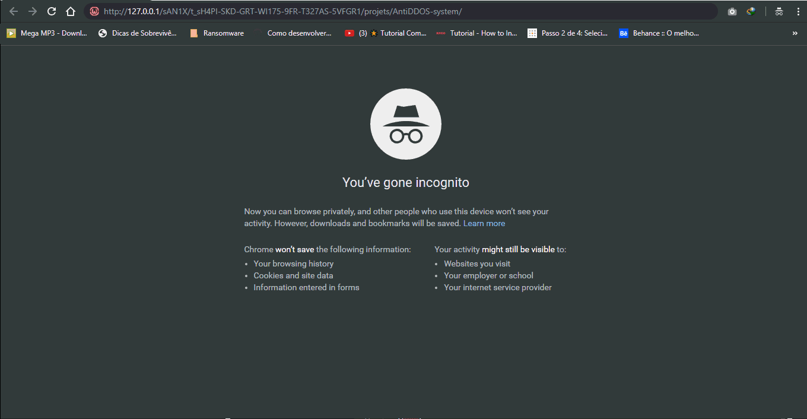
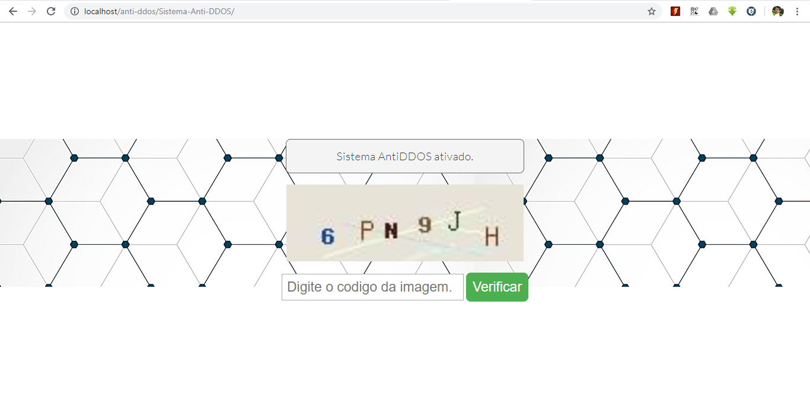

<h1>Sistema antiDDOS</h1>
Uma maneira simples de proteger seu aplicativo da Web contra o ataque DDOS (FREE) em * 1 linha *

## Como isso funciona?

Em cada conexão, o sistema salva temporariamente o endereço IP do cliente e monitora sua frequência de conexão, se essa frequência de conexão for anormal, o sistema a considera como um black ip e envia uma solicitação de verificação na forma de uma verificação Captcha integrado no sistema, se ele passar nesse cheque, então é um humano e não um robô!

### Testando...


**"Este projeto foi testado por diversos softwares de ddos com uma pontuação de 81%."**
## Como usá-lo?

### UTILIZAÇÃO BÁSICA
```php
<?php
	include ("./_antiDDOS/begin.php"); //escreva isto no topo da sua aplicação PHP!!!
?>
```

### UTILIZAÇÃO AVANÇADO:
```php
<?php
	try{
		if (!file_exists("./_antiDDOS/begin.php"))
			throw new Exception ('./_antiDDOS/begin.php não existe');
		else
			require_once("./_antiDDOS/begin.php"); 
	} 
	//Pegue a exceção se algo der errado.
	catch (Exception $ex) {
		require_once("./_antiDDOS/_app/Config.inc.php");
		//imprimir uma mensagem dizendo que há um erro
		echo '<div style="padding:10px;color:white;position:fixed;top:0;left:0;width:100%;background:black;text-align:center;">O <a href="https://github.com/dinhobala/Sistema-Anti-DDOS" target="_blank">"Sistema AntiDDOS"</a> não foi carregado corretamente neste site, por favor, comente o \'catch Exception\' para ver o que está acontecendo!</div>';
	}
?>
---- O CONTEÚDO DA PÁGINA HTML ----
```


## Autor

- [Diego Matos](https://github.com/dinhobala)

## LICENSE

[MIT License](https://github.com/dinhobala/Sistema-Anti-DDOS/blob/master/LICENSE)

PS: Deixe seu feedback para tornar este projeto mais poderoso do que nunca! ;-)


